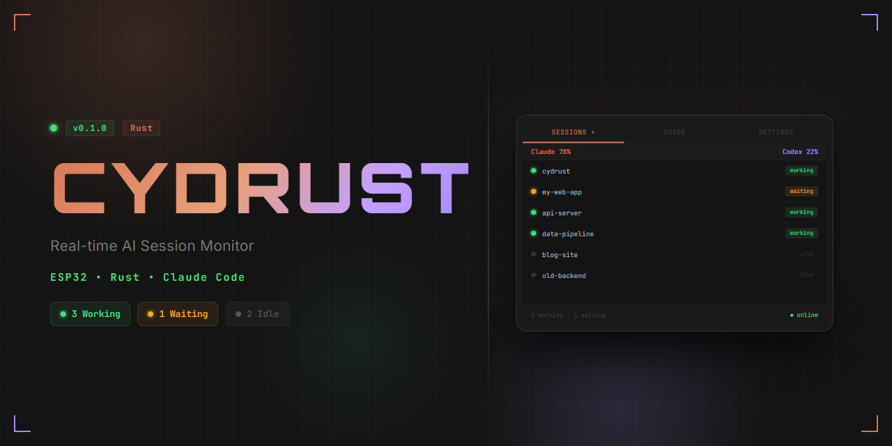

<div align="center">

  

  <h1>CYDRUST</h1>

  <p><strong>Cyberpunk Development Monitor — Real-time AI coding session tracker for Claude Code on ESP32</strong></p>

  <!-- Build & quality -->
  [](https://github.com/Liohtml/cydrust/actions/workflows/ci-bridge.yml)
  [](https://github.com/Liohtml/cydrust/actions/workflows/ci-firmware.yml)
  [](https://www.rust-lang.org/)
  [](LICENSE)

  <!-- Info -->
  [](https://docs.espressif.com/projects/esp-idf/)
  []()
  []()

</div>

---

## Demo / Preview

<div align="center">
  
</div>

> **What you see:** The ESP32's 320×240 LCD updates every 2 seconds. The top row shows the active tab (`SESSIONS`), while the header line displays Claude and Codex token-usage percentages in their signature brand colours. Each card in the session list names the project and carries a status glyph: `>>` in green for an actively typing session, `!` in amber when Claude is waiting for user input, and `z` in grey for idle. The red `hub offline` banner snaps in if the bridge stops responding for more than 6 seconds — and disappears the moment it comes back.

---

## Features

- **Real-time session cards** — up to 8 concurrent sessions from Claude Code, Codex, OpenCode, and Hermes rendered on a 320×240 ST7789 LCD at up to 5 fps
- **Four providers** — Claude, Codex, OpenCode, and Hermes all tracked simultaneously; sessions deduplicated per project across providers
- **Three status states** with distinct colours: Working (green `#4ADE80`), Waiting (amber `#F5A623`), Idle (grey)
- **Active-turn detection** — bridge infers mid-turn state from transcript tails (Claude), event markers (Codex), and message roles (OpenCode/Hermes) so a session stays "Working" even when the file hasn't been written yet
- **Session detail overlay** — tap any card for the full view: id, age, wait duration, and the session's first substantive prompt as a summary
- **Provider icons** — 18×18 px logos for all four providers alpha-composited onto the display via `draw_badge()`
- **USAGE tab** — live rate-limit gauges (5h % used, weekly %, burn/hr, leftover %, ETA clock) for Claude and Codex; sourced from the Anthropic API and Codex session files
- **METRICS tab** — today's per-model token/cost breakdown (up to 6 models); share bar + % label; totals line with optional USD sum; badge icon per provider row
- **Prometheus `/metrics`** — scrape-ready Prometheus text exposition at `:5151/metrics`; token-protected (scrape with `bearer_token`); covers session counts, per-model token/cost gauges, and provider totals
- **Multi-host federation** — `POST /federation/ingest` lets remote bridge nodes push session rows to an aggregator; `RemoteStore` keyed by `node/session-id` with 30 s TTL; aggregator `/state` merges local + remote rows transparently
- **Hook injection binaries** — `install_hooks` merges six hook events into `~/.claude/settings.json` idempotently (VIBE_MARKER blocks, preserves user hooks); `vibe_hook` is the lightweight per-event process spawned by Claude Code (exits 0 always, 1500 ms timeout)
- **NVS-persisted settings** — SETTINGS tab: backlight brightness (LEDC PWM, 10–100 %), sleep timer, dark/light theme; all survive power cycles
- **Dual transport** — WiFi for wireless operation, USB serial for zero-config corporate networks; `serial_bridge` reconnects automatically on device unplug/replug
- **OTA updates over WiFi** — `wifi,ota` feature uses `esp_https_ota`; dual OTA partition table (2×1664 KiB app slots, 4 MB flash); aborts cleanly and reboots to the old slot on failure
- **E-ink variant** — `eink` feature targets a Waveshare 2.9" B/W SSD1680/IL3820 e-paper panel via `epd-waveshare 0.6`; USB-transport only (mutually exclusive with `wifi`)
- **BLE transport** — NimBLE GATT server in `firmware/src/ble.rs` (code-complete + API-correct); blocked on `esp32-nimble 0.9/0.10` requiring a removed nightly feature; see [BLE note](#ble-transport-note) below
- **Pre-built firmware releases** — `firmware-release.yml` builds merged 4 MB flashable `.bin` images (bootloader + partition table + app) and attaches them to GitHub Releases on each `v*` tag; flash at offset `0x0` with `esptool` — no Rust toolchain required
- **Offline detection** — red banner fires after 3 missed polls (WiFi) or 6 s silence (USB), then self-heals
- **Flicker-free rendering** — data refreshes repaint in-place; full screen clears only on tab/view switches
- **Hook integration** — Claude Code `Notification` hook flips a session to *Waiting*; `POST /ack` clears it
- **Session sorting** — Waiting → Working → Idle, newest first within each group
- **4-hour TTL pruning** — stale sessions expired automatically; no manual cleanup needed
- **Dark / light theme** — switchable from SETTINGS; colour functions adapt every rendered element at runtime
- **Zero heap allocation on device** — firmware uses `heapless::Vec` / `heapless::String`; no `alloc` OOM surprises
- **Compact serial protocol** — `serial_bridge` emits short-key JSON (`i`, `a`, `ws`, `s`, `p`, `r`, `wp`, `b`, `lo`, `e`, plus `metrics`) well under the ESP32 UART FIFO limit
- **Auth token** — every bridge request requires `X-VibeMonitor-Token`; the device never exposes unauthenticated data
- **Capacity verdict** — `/state` includes a `capacity` object (`go` / `pace` / `throttle`) advising whether it's safe to start another agent

---

## Hardware Requirements

| Component | Specification | Notes |
|-----------|--------------|-------|
| **ESP32 board** | ESP32 DevKit v1 (ESP-WROOM-32) | Any board with SPI2, GPIO 2/13/14/15/21 broken out |
| **LCD display** | ST7789, 320×240, IPS | 2.8" or 2.4" modules work; ensure 3.3 V logic |
| **USB cable** | USB-A to Micro-B | CH340 driver required on Windows for COM port |
| **WiFi network** | 2.4 GHz 802.11 b/g/n | Only needed for WiFi transport mode |
| **Power** | 5 V via USB or LiPo 3.7 V | 80–120 mA draw with backlight on |
| **Host machine** | Windows 10/11 or Linux | Runs the `vibe-bridge` Axum server |

> **Recommended module:** The "Cheap Yellow Display" (CYD) — an all-in-one ESP32 + 320×240 ST7789 + USB-CH340 board — works out of the box with the default pin assignments below.

---

## Wiring Diagram

```
  ESP32 DevKit              ST7789 Module
  ─────────────            ────────────────
  3V3  ──────────────────► VCC   (3.3 V power)
  GND  ──────────────────► GND
  IO14 ──────────────────► SCL   (SPI clock)
  IO13 ──────────────────► SDA   (SPI MOSI)
  IO15 ──────────────────► CS    (chip select)
  IO2  ──────────────────── DC    (data/command)
  IO4  ──────────────────► RES   (reset — tie high if unused)
  IO21 ──────────────────► BLK   (backlight — driven HIGH in firmware)

  SPI bus: SPI2 (HSPI)  |  Baud: 55 MHz
```

> **CYD users:** The Cheap Yellow Display hard-wires these pins on the PCB — no jumpers needed. The backlight is on `GPIO21`. Reset is connected internally.

---

## Architecture

```
  ┌────────────────────────────────────────────────────────────────────┐
  │  Host Machine (Windows / Linux)                                    │
  │                                                                    │
  │   Claude Code         collector (every 2 s)                        │
  │   sessions ──────────► scans ~/.claude/projects/**/*.jsonl         │
  │   (.jsonl files)       extracts session id, project, mtime         │
  │                              │                                     │
  │                              ▼                                     │
  │                       state::Store  (RwLock<HashMap>)              │
  │                              │                                     │
  │                    ┌─────────┴──────────┐                          │
  │                    │   Axum HTTP server │  :5151                   │
  │                    │  GET  /state       │◄──── X-VibeMonitor-Token │
  │                    │  POST /ack         │                          │
  │                    │  POST /hook        │◄──── Claude Code hooks   │
  │                    └─────────┬──────────┘                          │
  │                              │                                     │
  │          ┌───────────────────┴───────────────────┐                 │
  │          │ WiFi path                             │ USB path        │
  │          │                                       │                 │
  │          │  (firmware polls                      │  serial_bridge  │
  │          │   /state directly)                    │  binary polls   │
  │          │                                       │  /state, writes │
  │          │                                       │  compact JSON   │
  │          │                                       │  to COM port    │
  └──────────┼───────────────────────────────────────┼─────────────────┘
             │                                       │
             │ HTTP (2 s)                            │ UART 115200 baud
             │                                       │ (~80 byte lines)
             ▼                                       ▼
     ┌──────────────────────────────────────────────────┐
     │              ESP32  (xtensa-esp32-espidf)         │
     │                                                   │
     │  parse_state()  →  DisplayState                   │
     │       │                                           │
     │       ▼                                           │
     │  render()  →  embedded-graphics  →  ST7789 LCD    │
     │                   320 × 240 px                    │
     └──────────────────────────────────────────────────┘
```

### Component summary

| Component | Crate / binary | Role |
|-----------|---------------|------|
| `bridge/src/collector.rs` | `walkdir`, `dirs-next` | Scans `~/.claude/projects` every 2 s |
| `bridge/src/collector_codex.rs` | `serde_json` | Reads Codex session DB; extracts usage + sessions |
| `bridge/src/collector_opencode.rs` | `rusqlite` | Reads OpenCode SQLite DB (bundled driver) |
| `bridge/src/collector_hermes.rs` | `rusqlite` | Reads Hermes SQLite DB |
| `bridge/src/state.rs` | stdlib `RwLock` | In-memory session store (upsert / ack / snapshot / reap) |
| `bridge/src/hub.rs` | `axum 0.8` | REST endpoints `/state`, `/ack`, `/hook`, `/metrics`, `/federation/ingest` |
| `bridge/src/federation.rs` | `ureq` | `RemoteStore` TTL cache; push (node→aggregator) and ingest (aggregator endpoint) |
| `bridge/src/metrics.rs` | stdlib | Prometheus text exposition for sessions, usage, and per-model cost |
| `bridge/src/bin/install_hooks.rs` | `serde_json` | Idempotent Claude Code hook installer (merges into `settings.json`) |
| `bridge/src/bin/vibe_hook.rs` | `ureq` | Lightweight per-event hook process spawned by Claude Code; always exits 0 |
| `bridge/src/bin/serial_bridge.rs` | `serialport`, `ureq` | USB transport proxy, emits compact short-key JSON |
| `firmware/src/main.rs` | `esp-idf-hal`, `mipidsi`, `embedded-graphics` | Display driver, JSON parser, settings (NVS), render loop |
| `firmware/src/icons.rs` | `embedded-graphics` | All four provider 18×18 logos with alpha compositing |
| `firmware/src/ota.rs` | `esp-idf-svc` | OTA update via `esp_https_ota`; aborts to old slot on failure |
| `firmware/src/eink.rs` | `epd-waveshare` | E-paper display driver for Waveshare 2.9" B/W (SSD1680/IL3820) |
| `firmware/src/ble.rs` | `esp32-nimble` | BLE GATT server — code-complete, toolchain-blocked (see note) |

---

## Quick Start

### Prerequisites

| Tool | Version | Install |
|------|---------|---------|
| Rust toolchain | stable | `rustup toolchain install stable` |
| Espressif Rust toolchain | `esp` channel | `rustup toolchain install esp` (via `espup`) |
| `espup` | latest | `cargo install espup && espup install` |
| `ldproxy` | latest | `cargo install ldproxy` |
| `espflash` | latest | `cargo install espflash` |
| Python 3 + pip | 3.10+ | Required by `embuild` for ESP-IDF download |

### 1 — Clone

```bash
git clone https://github.com/Liohtml/cydrust.git
cd cydrust
```

### 2 — Configure the bridge

Edit `bridge/config.toml` (already present, just change the token):

```toml
token = "your-secret-token-here"   # shared with the firmware
host  = "0.0.0.0"                  # bind address (127.0.0.1 for localhost-only)
port  = 5151
```

> Keep the token out of version control — add `bridge/config.toml` to `.gitignore` if you commit secrets.

### 3 — Build and run the bridge

```bash
cd bridge
cargo build --release
cargo run --release -- config.toml
# => INFO vibe-bridge listening on http://0.0.0.0:5151
```

The bridge starts scanning `~/.claude/projects` immediately.

### 4 — Wire up Claude Code hooks (optional but recommended)

**Automatic (recommended):** use the `install_hooks` binary to merge hook config into `~/.claude/settings.json` idempotently:

```bash
cd bridge
cargo run --bin install_hooks -- --url http://localhost:5151 --token your-secret-token-here
```

Re-run any time; it replaces the VIBE_MARKER block and leaves any other hooks untouched.

**Manual:** if you prefer to edit `settings.json` yourself, add a `Notification` hook so *Waiting* state fires in real time:

```json
{
  "hooks": {
    "Notification": [
      {
        "matcher": "",
        "hooks": [
          {
            "type": "command",
            "command": "curl -s -X POST http://localhost:5151/hook -H 'Content-Type: application/json' -H 'X-VibeMonitor-Token: your-secret-token-here' -d '{\"sessionId\":\"$SESSION_ID\",\"hook_event_name\":\"Notification\"}'"
          }
        ]
      }
    ]
  }
}
```

> Only `Notification` flips a session to *Waiting*. Other hook events (`Stop`, `PreToolUse`, etc.) are forwarded to the bridge for activity tracking but do not change the waiting flag.

### 5a — Build and flash (WiFi transport)

Set your WiFi credentials and bridge address as environment variables before building:

```bash
cd firmware

# Linux / macOS
export VIBE_SSID="MyWiFi"
export VIBE_PASS="hunter2"
export VIBE_HOST="192.168.1.42"   # IP of the machine running vibe-bridge
export VIBE_PORT="5151"
export VIBE_TOKEN="your-secret-token-here"

# Windows (PowerShell)
$env:VIBE_SSID  = "MyWiFi"
$env:VIBE_PASS  = "hunter2"
$env:VIBE_HOST  = "192.168.1.42"
$env:VIBE_PORT  = "5151"
$env:VIBE_TOKEN = "your-secret-token-here"

cargo build --release --features wifi
espflash flash --monitor target/xtensa-esp32-espidf/release/vibe-firmware
```

### 5b — Build and flash (USB / serial transport)

The default feature set builds for USB — no env vars needed:

```bash
cd firmware
cargo build --release          # no --features flag → USB mode
espflash flash --monitor target/xtensa-esp32-espidf/release/vibe-firmware
```

Then start the serial bridge on the host (in a separate terminal):

```bash
cd bridge
# Linux
cargo run --bin serial_bridge -- --port /dev/ttyUSB0

# Windows
cargo run --bin serial_bridge -- --port COM7

# Override bridge URL or token if needed
cargo run --bin serial_bridge -- --port COM7 --url http://localhost:5151 --token your-secret-token-here
```

> The serial bridge polls `/state` every 2 s, strips the payload to `~80 bytes`, and writes it to the ESP32's UART. ACK lines from the device are forwarded back to `POST /ack` automatically.

---

## Configuration

### Bridge — `bridge/config.toml`

| Field | Type | Default | Description |
|-------|------|---------|-------------|
| `token` | `String` | *(required)* | Shared secret. Sent as `X-VibeMonitor-Token` header |
| `host` | `String` | `"0.0.0.0"` | TCP bind address for the Axum server |
| `port` | `u16` | `5151` | TCP port |

#### Federation (optional)

Add a `[federation]` section to enable multi-host mode:

```toml
[federation]
role     = "node"                        # "node" | "aggregator" | "none" (default)
upstream = "http://192.168.1.100:5151"  # aggregator URL (node role only)
node_id  = "dev-rig-1"                  # prefix for remote session IDs
```

- **`node`** — pushes local session rows to `upstream` every 2 s via `POST /federation/ingest`
- **`aggregator`** — accepts ingest payloads from nodes; merges them into `/state` with 30 s TTL
- Omit the section (or set `role = "none"`) for standalone operation

### Firmware — environment variables (WiFi mode only)

| Variable | Example | Description |
|----------|---------|-------------|
| `VIBE_SSID` | `"HomeNet"` | 2.4 GHz WiFi SSID |
| `VIBE_PASS` | `"s3cret"` | WiFi WPA2 passphrase |
| `VIBE_HOST` | `"192.168.1.10"` | IP of the host running `vibe-bridge` |
| `VIBE_PORT` | `"5151"` | Port of `vibe-bridge` |
| `VIBE_TOKEN` | `"HGWc..."` | Must match bridge `config.toml` `token` |

These are baked into the binary at compile time via `env!()` macros; no runtime config file on the device.

### Firmware — build features

| Feature flag | Default | Effect |
|-------------|---------|--------|
| *(none)* | yes | USB serial transport via UART0 |
| `wifi` | no | WiFi transport; requires `VIBE_*` env vars |
| `wifi,ota` | no | WiFi + OTA updates via `esp_https_ota`; uses `partitions_ota.csv` |
| `eink` | no | E-paper display (Waveshare 2.9" B/W); USB-transport only — **mutually exclusive with `wifi`** |
| `ble` | no | BLE GATT server; code-complete but toolchain-blocked — see [BLE note](#ble-transport-note) |

```bash
# USB (default)
cargo build --release

# WiFi
cargo build --release --features wifi

# WiFi + OTA
cargo build --release --features wifi,ota

# E-ink (USB transport, separate SPI bus)
cargo build --release --features eink
```

### Tunable constants (source-level)

| Constant | Location | Default | Description |
|----------|----------|---------|-------------|
| `WORKING_SEC` | `bridge/src/hub.rs:60` | `60.0` s | Age threshold below which a session is *Working* |
| `GONE_TTL` | `bridge/src/hub.rs:61` | `14400.0` s | Sessions older than 4 hours are pruned from `/state` |
| `POLL_MS` | `firmware/src/main.rs:137` | `2000` ms | WiFi poll interval |
| `POLL_SECS` | `bridge/src/bin/serial_bridge.rs:25` | `2` s | Serial bridge push interval |
| `BAUD` | `bridge/src/bin/serial_bridge.rs:26` | `115200` | UART baud rate |

---

## API Reference

All endpoints require the `X-VibeMonitor-Token` header matching `config.toml:token`. Requests without it return `401 Unauthorized`.

### `GET /state`

Returns current session list and usage snapshot.

**Request**

```http
GET /state HTTP/1.1
X-VibeMonitor-Token: HGWcjjofIUFUTLxo
```

**Response** `200 OK`

```jsonc
{
  "ts": 1750000000,          // Unix timestamp (seconds)
  "staleSec": 1,             // seconds since last collector scan (-1 = never scanned)
  "sessions": [
    {
      "id": "abc123",        // session UUID (JSONL file stem)
      "tool": "claude",      // always "claude" in current collector
      "project": "cydrust",  // derived from parent directory name
      "status": "working",   // "working" | "waiting" | "idle"
      "ageSec": 12,          // seconds since last activity
      "waiting": false,
      "waitingSec": null     // seconds in waiting state (null if not waiting)
    },
    {
      "id": "def456",
      "tool": "claude",
      "project": "myapp",
      "status": "waiting",
      "ageSec": 95,
      "waiting": true,
      "waitingSec": 42
    }
  ],
  "usage": {
    "claude": {
      "ok": true,
      "pct": 0.42,             // 0..1 fraction of period limit consumed
      "resetSec": 7200,        // seconds until usage counter resets
      "weekPct": 0.18,         // fraction of weekly limit consumed (-1 = unknown)
      "weekResetSec": 432000,  // seconds until weekly reset (-1 = unknown)
      "willExhaustBeforeReset": false,
      "burnPerHr": 0.031,      // usage fraction consumed per hour (0 = unknown)
      "leftoverPct": 0.58,     // fraction remaining (-1 = unknown)
      "etaClock": "14:30"      // wall-clock time of reset ("" = unknown)
    },
    "codex": { "ok": false }   // provider inactive — only "ok" field present
  }
}
```

**Session status logic**

```
waiting == true          → "waiting"
age_sec < 60             → "working"
60 ≤ age_sec < 14400     → "idle"
age_sec ≥ 14400          → pruned (not returned)
```

Sessions are sorted: `waiting` first, then `working`, then `idle`.

---

### `POST /ack`

Clears the *waiting* flag on a session (e.g., after the user has responded to Claude's prompt).

**Request**

```http
POST /ack HTTP/1.1
Content-Type: application/json
X-VibeMonitor-Token: HGWcjjofIUFUTLxo

{"id": "abc123"}
```

**Response** `200 OK` (empty body)

---

### `POST /hook`

Receives Claude Code hook events. Only the `Notification` event sets a session to *Waiting*; all other events are accepted and update activity timestamps but do not change the waiting flag.

**Request**

```http
POST /hook HTTP/1.1
Content-Type: application/json
X-VibeMonitor-Token: HGWcjjofIUFUTLxo

{
  "sessionId": "abc123",
  "hook_event_name": "Notification"
}
```

Both `id`/`sessionId` and `event`/`hook_event_name` field aliases are accepted.

**Response** `200 OK` (empty body)

**Events that trigger *waiting*:** `"Notification"` only.
All other event names (including `"Stop"`) are silently accepted and ignored for the waiting flag.

---

### `GET /metrics`

Prometheus text exposition. Requires the bearer token (same `X-VibeMonitor-Token` header as the other endpoints), so usage and cost data is not exposed unauthenticated when the hub binds a non-localhost address. Configure your Prometheus scrape job with `bearer_token`/`authorization`, or a custom `X-VibeMonitor-Token` header.

```
GET /metrics HTTP/1.1
X-VibeMonitor-Token: your-secret-token-here
```

**Response** `200 OK` — `Content-Type: text/plain; version=0.0.4`

```
# HELP vibe_sessions_total Number of live sessions by status
# TYPE vibe_sessions_total gauge
vibe_sessions_total{status="working"} 2
vibe_sessions_total{status="waiting"} 1
vibe_sessions_total{status="idle"} 3
# HELP vibe_model_tokens_total Token count per model today
# TYPE vibe_model_tokens_total gauge
vibe_model_tokens_total{model="claude-opus-4-5",provider="claude"} 142000
...
```

---

### `POST /federation/ingest`

Accepts a session payload from a node bridge and merges it into the aggregator's `RemoteStore` with a 30 s TTL.

**Request**

```http
POST /federation/ingest HTTP/1.1
Content-Type: application/json
X-VibeMonitor-Token: HGWcjjofIUFUTLxo

{
  "node_id": "dev-rig-1",
  "ts": 1750000000,
  "sessions": [
    { "id": "abc123", "tool": "claude", "project": "cydrust",
      "status": "working", "age_sec": 12, "waiting": false }
  ]
}
```

**Response** `200 OK` (empty body)

---

## Project Structure

```
cydrust/
├── bridge/                         # Host-side Rust/Axum server
│   ├── Cargo.toml                  # vibe-bridge crate (axum, tokio, walkdir, ureq, rusqlite…)
│   ├── config.toml                 # Runtime config: token, host, port, [federation]
│   ├── deny.toml                   # cargo-deny license + advisory policy
│   └── src/
│       ├── main.rs                 # Entry point — config, background threads, HTTP server
│       ├── collector.rs            # Walks ~/.claude/projects/**/*.jsonl every 2 s
│       ├── collector_codex.rs      # Reads Codex session DB for usage + sessions
│       ├── collector_opencode.rs   # Reads OpenCode SQLite DB via bundled rusqlite
│       ├── collector_hermes.rs     # Reads Hermes SQLite DB
│       ├── state.rs                # RwLock<HashMap> session store (upsert / ack / snapshot / reap)
│       ├── hub.rs                  # Axum router: /state, /ack, /hook, /metrics, /federation/ingest
│       ├── federation.rs           # RemoteStore TTL cache + push loop (node→aggregator)
│       ├── metrics.rs              # Prometheus text exposition (sessions + usage + cost)
│       ├── model.rs                # Shared types: Session, SessionRow, StateResponse, Metrics…
│       ├── usage.rs                # Usage polling (Anthropic API + Codex)
│       └── bin/
│           ├── serial_bridge.rs    # USB transport binary: polls /state → COM port
│           ├── install_hooks.rs    # Idempotent Claude Code hook installer (settings.json)
│           └── vibe_hook.rs        # Per-event hook process spawned by Claude Code
│
├── firmware/                       # ESP32 embedded Rust
│   ├── Cargo.toml                  # vibe-firmware crate; features: wifi, ota, eink, ble
│   ├── build.rs                    # embuild sysenv output (ESP-IDF integration)
│   ├── rust-toolchain.toml         # channel = "esp"
│   ├── partitions_ota.csv          # Dual OTA partition table (2×1664 KiB, 4 MB flash)
│   ├── sdkconfig.defaults          # Base ESP-IDF sdkconfig
│   ├── sdkconfig.defaults.ota      # OTA-specific sdkconfig overrides
│   ├── sdkconfig.defaults.ble      # BLE-specific sdkconfig overrides
│   ├── package.sh / package.ps1    # Merges bootloader + table + app into flashable .bin
│   ├── RELEASES.md                 # Pre-built release instructions
│   ├── deny.toml                   # cargo-deny policy for firmware workspace
│   └── src/
│       ├── main.rs                 # SPI init, render(), parse_state(), settings (NVS), all transport loops
│       ├── icons.rs                # All four provider 18×18 logos (r5,g6,b5,alpha pixel arrays)
│       ├── ota.rs                  # OTA update via esp_https_ota (wifi,ota feature)
│       ├── eink.rs                 # E-paper display driver — Waveshare 2.9" B/W (eink feature)
│       └── ble.rs                  # BLE GATT server — NimBLE, newline-JSON frames (ble feature)
│
└── docs/
    └── assets/
        ├── banner.png              # Header banner
        └── demo.gif                # Screen recording of the live display
```

---

## Development

### Running the bridge locally (no hardware)

```bash
cd bridge
cargo run -- config.toml
```

Verify with curl:

```bash
curl -s http://localhost:5151/state \
  -H "X-VibeMonitor-Token: HGWcjjofIUFUTLxo" | jq .
```

Trigger a waiting state manually:

```bash
curl -s -X POST http://localhost:5151/hook \
  -H "Content-Type: application/json" \
  -H "X-VibeMonitor-Token: HGWcjjofIUFUTLxo" \
  -d '{"sessionId":"test-id","hook_event_name":"Notification"}'
```

Clear it:

```bash
curl -s -X POST http://localhost:5151/ack \
  -H "Content-Type: application/json" \
  -H "X-VibeMonitor-Token: HGWcjjofIUFUTLxo" \
  -d '{"id":"test-id"}'
```

### Running bridge tests

```bash
cd bridge
cargo test
cargo clippy -- -D warnings
cargo fmt --check
```

### Firmware — iterating without hardware

The render logic is pure `embedded-graphics` code and can be unit-tested against a mock display target:

```bash
cd firmware
cargo check                      # type-check without flashing
cargo check --features wifi      # also checks WiFi code paths
```

### Firmware — monitoring serial output

```bash
espflash monitor --port /dev/ttyUSB0    # Linux
espflash monitor --port COM7            # Windows
```

### Changing the colour palette

Colours are returned by small inline functions in `firmware/src/main.rs` so the dark/light theme can switch them at runtime. The dark-theme defaults are:

```rust
fn c_bg()     -> Rgb565 { Rgb565::new(2,  5,  2)  }  // #141414 dark background
fn c_claude() -> Rgb565 { Rgb565::new(26, 29, 11) }  // #D97757 Claude orange
fn c_codex()  -> Rgb565 { Rgb565::new(20, 34, 30) }  // #A78BFA Codex purple
fn c_work()   -> Rgb565 { Rgb565::new(9,  55, 16) }  // #4ADE80 working green
fn c_wait()   -> Rgb565 { Rgb565::new(30, 41,  4) }  // #F5A623 waiting amber
fn c_offline()-> Rgb565 { Rgb565::new(28, 18,  9) }  // #E5484D offline red

// Provider accent colours used in detail overlay headers
const BRAND_OPENCODE: Rgb565 = Rgb565::new(2, 46, 20);  // teal-green
const BRAND_HERMES:   Rgb565 = Rgb565::new(7, 32, 30);  // blue
```

`Rgb565::new(r, g, b)` takes 5-bit R, 6-bit G, 5-bit B values. Use an online RGB565 converter to map hex colours. To add a light theme, check `Settings.dark` inside each function and return an alternate value.

### Adding support for other AI tools

The firmware currently renders native icons for four providers via `draw_badge()` in `firmware/src/main.rs`:

| `tool` string | Icon | Accent colour |
|--------------|------|--------------|
| `"claude"` (default) | Claude pixel logo | Orange `#D97757` |
| `"codex"` | Codex pixel logo | Purple `#A78BFA` |
| `"opencode"` | OpenCode terminal logo | Teal-green |
| `"hermes"` | Hermes gradient logo | Blue |

To add a fifth provider:

1. Add a collector in `bridge/src/collector.rs` that scans the relevant session directory and sets the `tool` field
2. Add an 18×18 px RGBA pixel array to `firmware/src/icons.rs` (use a 2-bit alpha: `0` = transparent, `255` = opaque)
3. Extend `draw_badge()` and `provider_meta()` in `firmware/src/main.rs` to dispatch to the new icon and return the correct name + accent colour

---

## Troubleshooting

### Display shows nothing / white screen

| Check | Resolution |
|-------|-----------|
| Backlight | `GPIO21` must be driven HIGH — verify it is not floating |
| SPI pins | Double-check SCL=14, SDA=13, CS=15, DC=2 against your module's pinout |
| Power | Some 3.2" ST7789 modules need 3.3 V; never connect VCC to 5 V |
| `display init failed` in serial monitor | Try swapping `ColorInversion::Inverted` ↔ `Normal` and `ColorOrder::Bgr` ↔ `Rgb` in `firmware/src/main.rs` |
| Build for wrong target | Confirm `firmware/.cargo/config.toml` has `target = "xtensa-esp32-espidf"` |

### WiFi not connecting

```
[ERROR] WifiError: EspError(...)
```

| Check | Resolution |
|-------|-----------|
| Env vars baked in | Rebuild after exporting `VIBE_SSID` / `VIBE_PASS` — values are compile-time constants |
| 5 GHz network | ESP32 only supports 2.4 GHz; check your router band |
| SSID length | Max 32 chars; use `try_into()` error logs to detect truncation |
| Bridge unreachable | Ping `VIBE_HOST` from another device on the same subnet; check firewall on port `5151` |
| `401 Unauthorized` | `VIBE_TOKEN` must exactly match `config.toml:token` |

### Serial bridge / USB timeout

```
[serial_bridge] write error: ...
```

| Check | Resolution |
|-------|-----------|
| COM port | Run `mode` (Windows) or `ls /dev/ttyUSB*` (Linux) to confirm the port name |
| CH340 driver | Download from [wch-ic.com](https://www.wch-ic.com/downloads/CH341SER_EXE.html) for Windows |
| DTR/RTS reset loop | The serial bridge explicitly lowers DTR and RTS to prevent the CH340 from resetting the ESP32 on connect |
| Firmware in USB mode | Ensure you built **without** `--features wifi`; WiFi builds do not read from UART0 |
| Baud rate mismatch | Both sides are hardcoded to `115200`; do not change one without the other |

### Sessions not appearing

| Check | Resolution |
|-------|-----------|
| Claude projects dir | Bridge scans `~/.claude/projects/`; run `ls ~/.claude/projects` to confirm JSONL files exist |
| Active Claude Code session | Open a project in Claude Code; JSONL files are created on first tool use |
| Bridge not running | `curl http://localhost:5151/state -H "X-VibeMonitor-Token: <tok>"` should return JSON |
| Age threshold | A session appears as *working* only if its JSONL mtime is < 60 s ago |

### `hub offline` banner stuck

The banner appears when:
- **WiFi mode:** 3 or more consecutive failed HTTP requests to `/state`
- **USB mode:** no newline received on UART within the last 6 seconds

Check: is `vibe-bridge` running? Is `serial_bridge` running (USB mode)? Check firewall rules.

---

## Roadmap

- [x] Core bridge: collector + REST API + token auth
- [x] ST7789 display driver with `embedded-graphics`
- [x] WiFi transport (polling)
- [x] USB / serial transport + `serial_bridge` binary
- [x] Hook integration — `Notification` → *Waiting* state; `install_hooks` + `vibe_hook` binaries
- [x] Offline detection and recovery banner
- [x] USAGE tab — full token usage model: period %, weekly %, burn rate, ETA clock
- [x] SETTINGS tab — brightness (LEDC PWM), sleep timer, dark/light theme, NVS-persisted
- [x] Session detail overlay — per-session id, age, wait duration, summary
- [x] Provider icons — all four provider 18×18 logos on display
- [x] Flicker-free rendering — background refresh without full screen clear
- [x] Extended serial protocol — full usage + session metadata in compact short-key format
- [x] Prometheus `/metrics` endpoint — scrape-ready session/usage/cost exposition at `:5151/metrics`
- [x] Multi-host federation — `/federation/ingest`, `RemoteStore` with 30 s TTL, node-id prefixing
- [x] OTA firmware updates over WiFi — `esp_https_ota`, dual OTA partition table, abort-on-failure
- [x] `e-ink` variant — Waveshare 2.9" B/W via `epd-waveshare 0.6` (`--features eink`)
- [x] Pre-built firmware releases — `firmware-release.yml` produces merged 4 MB `.bin` on each `v*` tag
- [~] BLE transport — code-complete (NimBLE GATT server); blocked on toolchain version alignment (see below)

### BLE transport note

`firmware/src/ble.rs` is API-correct and compiles in isolation, but `esp32-nimble 0.9/0.10` — the only versions that match `esp-idf-svc 0.50` — require the `inline_const_pat` Rust nightly feature that was removed. Upgrading to `esp32-nimble 0.11+` (which fixes this) also requires `esp-idf-svc 0.51`, which introduces breaking changes to the default LCD build. Resolution requires a coordinated `esp-idf-svc` / `esp32-nimble` version bump across the whole firmware crate.

---

## Contributing

Contributions are welcome. Please read [CONTRIBUTING.md](CONTRIBUTING.md) before opening a pull request.

**Quick checklist:**

- Run `cargo fmt` and `cargo clippy -- -D warnings` in both `bridge/` and `firmware/`
- Keep `firmware/src/main.rs` `no_std`-friendly: no heap-allocated `String` or `Vec` — use `heapless` equivalents
- For large features, open an issue first to discuss the design
- The colour palette and pin assignments are intentional — ask before changing defaults

---

## License

This project is licensed under the **MIT License** — see the [LICENSE](LICENSE) file for details.

---

<div align="center">
  <sub>Built with Rust, embedded-graphics, Axum, and too much coffee. Inspired by the neon glow of a terminal at 2 AM.</sub>
</div>
