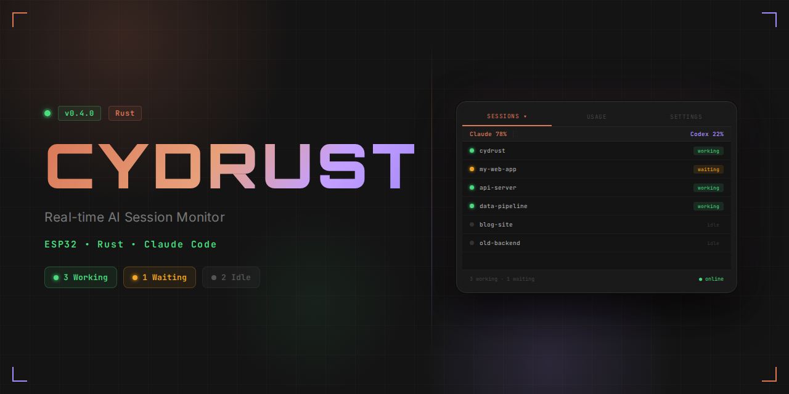
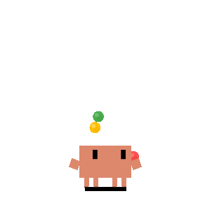
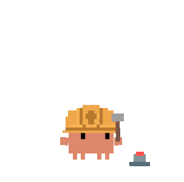

<div align="center">

  

  <h1>CYDRUST</h1>

  <p><strong>Cyberpunk Development Monitor — Real-time AI coding session tracker for Claude Code on ESP32</strong></p>

  <!-- Build & quality -->
  [](https://github.com/Liohtml/cydrust/actions/workflows/ci.yml)
  [](https://github.com/Liohtml/cydrust/actions/workflows/security.yml)
  [](https://www.rust-lang.org/)
  [](LICENSE)

  <!-- Info -->
  [](https://docs.espressif.com/projects/esp-idf/)
  []()
  []()

</div>

---

## Demo / Preview

<!-- docs/assets/README.md documents the recording spec for a demo.gif; until that
     capture exists, the banner stands in as the preview image. -->
<div align="center">
  
</div>

> **What you see:** The ESP32's 320×240 LCD updates every 2 seconds. The top row shows the active tab (`SESSIONS`), while the header line displays Claude and Codex token-usage percentages in their signature brand colours. Each card in the session list names the project and carries a status glyph: `>>` in green for an actively typing session, `!` in amber when Claude is waiting for user input, and `z` in grey for idle. The red `hub offline` banner snaps in if the bridge stops responding for more than 6 seconds — and disappears the moment it comes back.

---

## Why CYDRUST

Claude Code (and Codex, OpenCode, Hermes) sessions run invisibly in terminal tabs.
CYDRUST turns that activity into a physical status board: a $10 ESP32 + LCD on your
desk that shows which sessions are working, which are waiting on you, and how close
you are to your usage limits — no browser tab required.

## Features

- **Real-time session cards** — up to 8 concurrent sessions from Claude Code, Codex, OpenCode, and Hermes on a 320×240 ST7789 LCD at up to 5 fps
- **Four providers, deduplicated per project** — distinct icons and accent colours for Claude, Codex, OpenCode, and Hermes
- **Three status states** — Working (green), Waiting (amber), Idle (grey), with active-turn detection from transcript/event/message data so "Working" doesn't flicker off mid-turn
- **USAGE and METRICS tabs** — live rate-limit gauges (5h/weekly %, burn/hr, ETA) and per-model token/cost breakdown
- **Prometheus `/metrics`** and **multi-host federation** (`POST /federation/ingest`) — scrape-ready exposition and cross-machine session aggregation
- **Dual transport** — WiFi (wireless) or USB serial (zero-config, corporate-network friendly), plus OTA updates and an e-ink display variant
- **Hook-driven status** — `install_hooks` wires Claude Code's `Notification` and `Stop` hooks into the bridge so *Waiting* flips on and off in real time (see [docs/api.md](docs/api.md#post-hook))
- **NVS-persisted settings, dark/light theme, zero heap allocation on-device** — see [docs/architecture.md](docs/architecture.md) for the full feature/component breakdown

See [docs/architecture.md](docs/architecture.md) for the complete feature-to-component
mapping, and [docs/api.md](docs/api.md) for every endpoint and payload shape.

---

## Pixel-art screensaver

The **PIXEL** tab shows an animated mascot whose animation reflects what your
agents are doing. After an idle period it takes over the whole screen as a
screensaver; any touch returns you to the tab you were on.

| Animation | Shown when |
| --- | --- |
|  | a session is **waiting** for you |
|  | **two or more** sessions are working |
|  | one session has been working but produced no output for over 2 minutes — a long build or tool call |
|  | exactly **one** session is working |
|  | nothing is running, everything is idle, or the bridge is offline |

Checks run top-down and the first match wins — except an offline bridge is
checked *before* all of them: stale session data must never be shown as a
session waiting for you, so a lost connection always falls back to Sleeping.
While the bridge is reachable, "waiting" is checked first among the rest,
since that's the state that wants a human.

Configure it under **SET → Idle art**: `Off`, `30s`, `1m`, `5m`. Values that
would never fire because the screen blanks first (see **Sleep after**) are
shown dimmed and cannot be selected.

The artwork is adapted from [clawd](https://github.com/KebeliSamet0/clawd) by
KebeliSamet0, used under the MIT License. See `assets/gif/NOTICE`.

---

## Hardware Requirements

| Component | Specification |
|-----------|--------------|
| **ESP32 board** | ESP32 DevKit v1 (ESP-WROOM-32) or the "Cheap Yellow Display" (CYD) all-in-one |
| **LCD display** | ST7789, 320×240, IPS, 3.3 V logic |
| **USB cable** | USB-A to Micro-B (CH340 driver required on Windows) |
| **WiFi network** | 2.4 GHz 802.11 b/g/n — only needed for WiFi transport mode |
| **Host machine** | Windows 10/11 or Linux, running the `vibe-bridge` Axum server |

Full bill of materials, pin-out tables, and the wiring diagram live in
[docs/hardware.md](docs/hardware.md).

---

## Architecture

The host-side **bridge** (Rust/Axum) scans `~/.claude/projects/**/*.jsonl` every 2 s,
holds session state in an in-memory `RwLock<HashMap>`, and exposes it over a small,
token-authenticated HTTP API (`/state`, `/ack`, `/hook`, `/metrics`,
`/federation/ingest`). The ESP32 **firmware** reaches that API either over WiFi
(direct polling) or USB serial (via the `serial_bridge` relay binary), and renders
session cards, usage gauges, and settings on the ST7789 LCD.

Full component diagrams, the session-status state machine, and the concurrency model
are documented in [docs/architecture.md](docs/architecture.md).

---

## Quick Start

### Prerequisites

| Tool | Install |
|------|---------|
| Rust stable | `rustup toolchain install stable` |
| Espressif Rust toolchain | `cargo install espup && espup install` |
| `ldproxy`, `espflash` | `cargo install ldproxy espflash` |
| Python 3.10+ | Required by `embuild` for ESP-IDF download |

Linux/WSL2 also needs `build-essential pkg-config libudev-dev` and dialout-group
membership for USB serial access — see [docs/development.md](docs/development.md#prerequisites)
for the exact commands.

### 1 — Clone and configure

```bash
git clone https://github.com/Liohtml/cydrust.git
cd cydrust
# edit bridge/config.toml — set a random token, keep it out of version control
```

### 2 — Build and run the bridge

```bash
cd bridge
cargo run --release --bin vibe-bridge -- config.toml
# => INFO vibe-bridge listening on http://0.0.0.0:5151
```

### 3 — Wire up Claude Code hooks (optional but recommended)

```bash
cargo run --bin install_hooks -- --url http://localhost:5151 --token your-secret-token-here
```

This merges a `Notification` + `Stop` hook pair into `~/.claude/settings.json`
idempotently — `Notification` flips a session to *Waiting*, `Stop` clears it when the
turn ends. Re-run any time; it replaces only its own marker block. See
[docs/api.md#post-hook](docs/api.md#post-hook) for the manual JSON if you'd rather not
run the installer.

### 4 — Build and flash the firmware

```bash
cd firmware
cargo build --release                    # USB transport (default, no env vars needed)
# or: cargo build --release --features wifi   (needs VIBE_SSID/VIBE_PASS/VIBE_HOST/VIBE_PORT/VIBE_TOKEN)
espflash flash --monitor target/xtensa-esp32-espidf/release/vibe-firmware
```

For USB transport, also start the serial relay on the host:

```bash
cd bridge && cargo run --bin serial_bridge -- --port /dev/ttyUSB0   # or COM7 on Windows
```

**Running under WSL2?** See [docs/wsl2.md](docs/wsl2.md) for `usbipd` device forwarding
and the `just wsl-up` helper.

Full configuration reference (bridge `config.toml`, federation, firmware feature flags,
environment variables, tunable constants) is in [docs/development.md](docs/development.md).

---

## Documentation

| Doc | Covers |
|-----|--------|
| [docs/architecture.md](docs/architecture.md) | Component diagram, data flow, session lifecycle, concurrency model |
| [docs/api.md](docs/api.md) | Every HTTP endpoint, request/response payloads, hook event semantics |
| [docs/hardware.md](docs/hardware.md) | Bill of materials, wiring, pin configuration, flashing, touch calibration |
| [docs/development.md](docs/development.md) | Local dev setup, testing, linting, feature flags, colour palette, adding a provider |
| [docs/wsl2.md](docs/wsl2.md) | WSL2 + usbipd setup for Windows hosts |
| [docs/troubleshooting.md](docs/troubleshooting.md) | Display, WiFi, serial, and session-visibility troubleshooting |

---

## Troubleshooting

Having trouble? [docs/troubleshooting.md](docs/troubleshooting.md) covers the common
cases: blank/white display, WiFi not connecting, serial/USB timeouts, sessions not
appearing, and a stuck `hub offline` banner.

---

## Roadmap

- [x] Core bridge: collector + REST API + token auth
- [x] ST7789 display driver with `embedded-graphics`
- [x] WiFi transport — polling and device ACK (`POST /ack` over HTTP)
- [x] USB / serial transport + `serial_bridge` binary
- [x] Hook integration — `Notification` → *Waiting*, `Stop` → clears it; `install_hooks` + `vibe_hook` binaries
- [x] Offline detection and recovery banner
- [x] USAGE tab, METRICS tab, SETTINGS tab (NVS-persisted)
- [x] Session detail overlay, provider icons, flicker-free rendering
- [x] Prometheus `/metrics` and multi-host federation (`/federation/ingest`)
- [x] OTA firmware updates over WiFi; pre-built release `.bin` images per `v*` tag
- [x] `eink` variant — Waveshare 2.9" B/W via `epd-waveshare`
- [~] BLE transport — code-complete (NimBLE GATT server); blocked on toolchain version alignment (see below)

### BLE transport note

`firmware/src/ble.rs` is API-correct and compiles in isolation, but `esp32-nimble 0.9/0.10` — the only versions that match `esp-idf-svc 0.50` — require the `inline_const_pat` Rust nightly feature that was removed. Upgrading to `esp32-nimble 0.11+` (which fixes this) also requires `esp-idf-svc 0.51`, which introduces breaking changes to the default LCD build. Resolution requires a coordinated `esp-idf-svc` / `esp32-nimble` version bump across the whole firmware crate.

---

## Contributing

Contributions are welcome. Please read [CONTRIBUTING.md](CONTRIBUTING.md) before opening
a pull request. Quick checklist: `cargo fmt` + `cargo clippy -- -D warnings` in both
`bridge/` and `firmware/`; keep `firmware/src/main.rs` `no_std`-friendly (`heapless`
types, no heap-allocated `String`/`Vec`); open an issue first for large design changes.

---

## License

This project is licensed under the **MIT License** — see the [LICENSE](LICENSE) file for details.

---

<div align="center">
  <sub>Built with Rust, embedded-graphics, Axum, and too much coffee. Inspired by the neon glow of a terminal at 2 AM.</sub>
</div>
